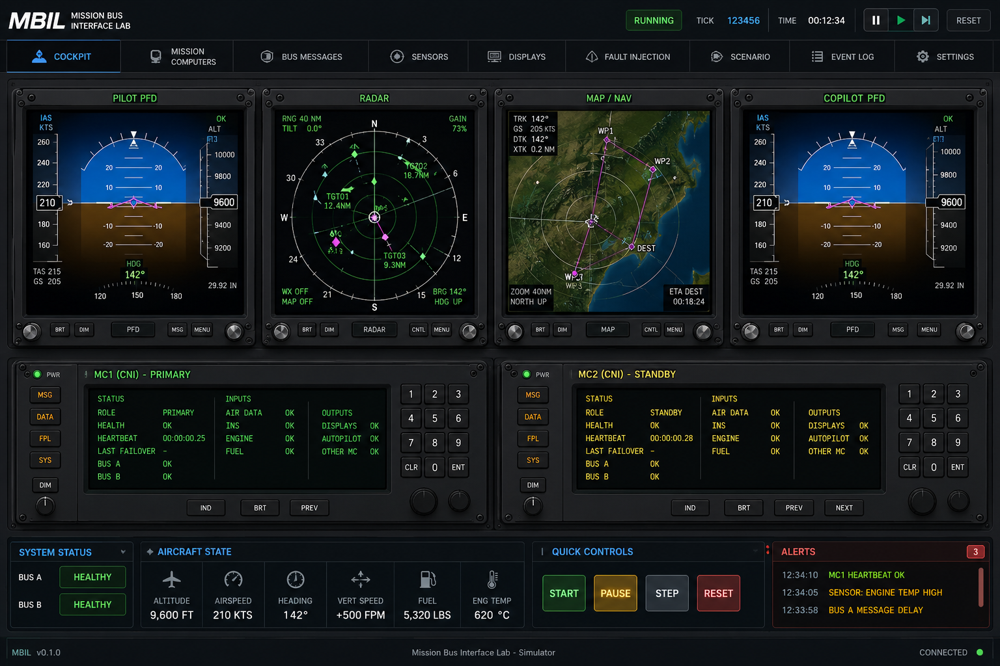
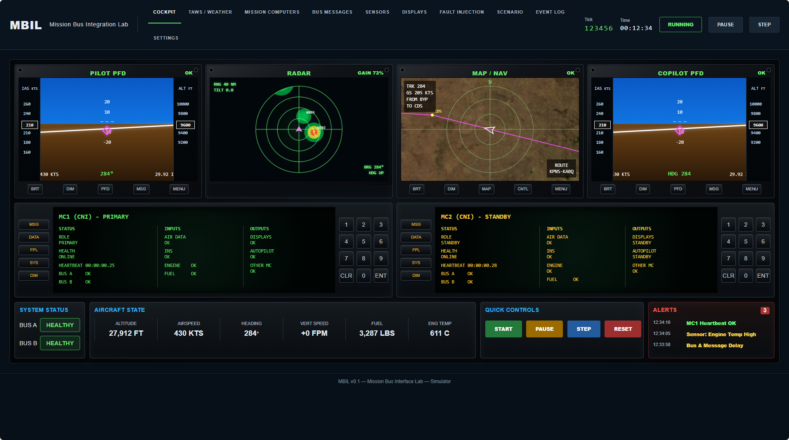
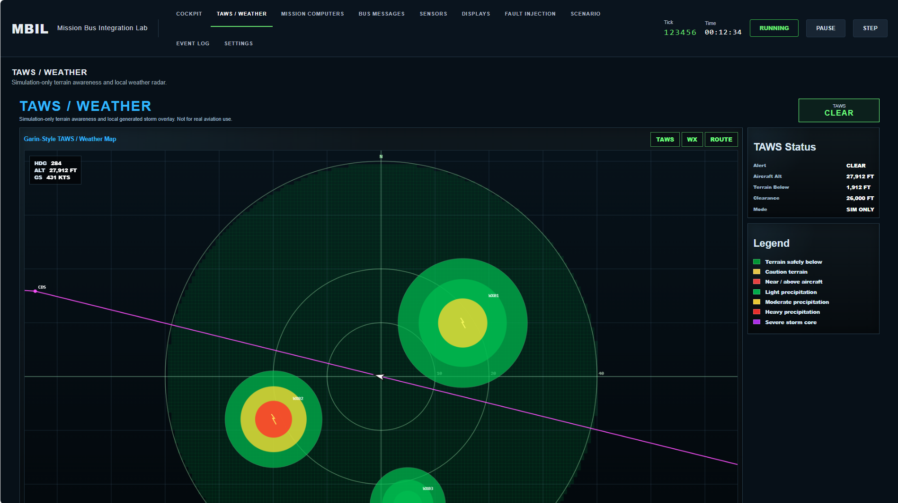
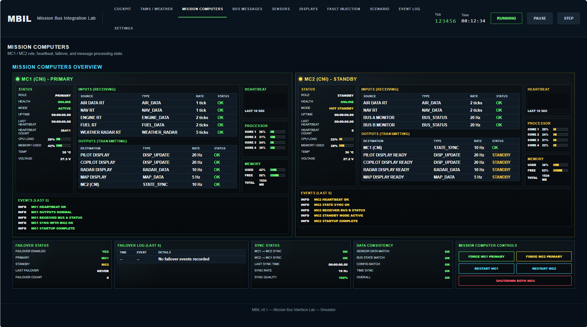
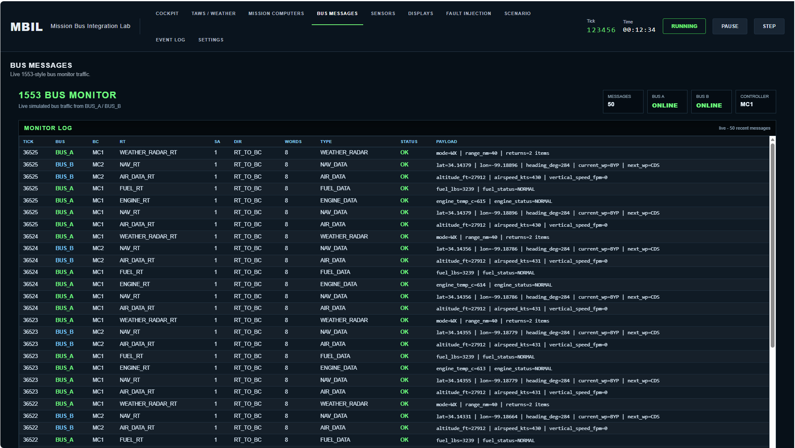
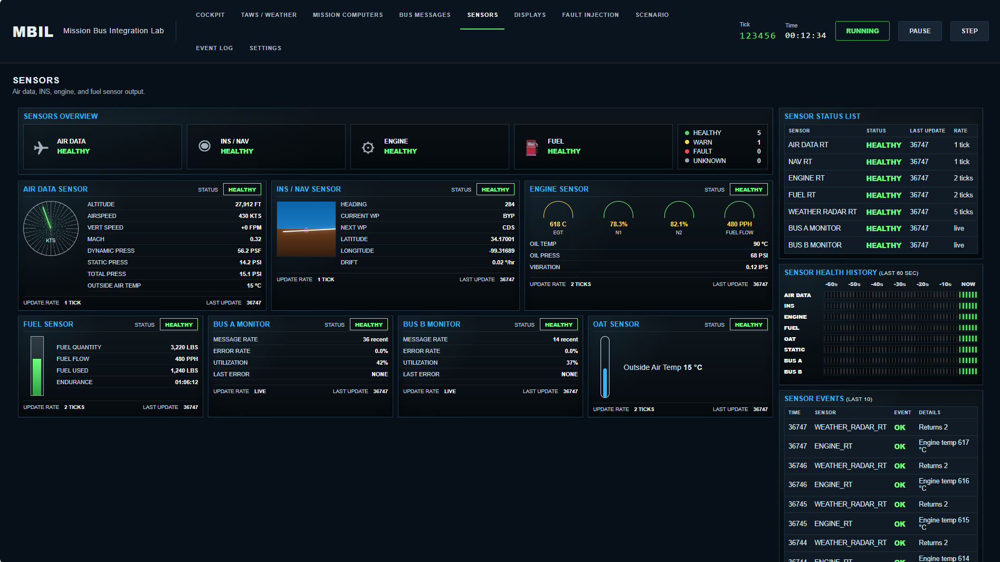

# MBIL - Mission Bus Integration Lab

Local-only FastAPI/Jinja2 web simulator. No npm, no hardware.

## ##ScreenShot








## Install

```bash
cd mbil_project
python3 -m venv .venv
source .venv/bin/activate
pip install -r requirements.txt
```

## Run

```bash
uvicorn app.main:app --host 0.0.0.0 --port 8000 --reload
```

Open from the host browser using the VM IP:

```text
http://VM-IP:8000/
```

The root page redirects to `/overview`, like the PlantSimulator project redirects to its dashboard.
